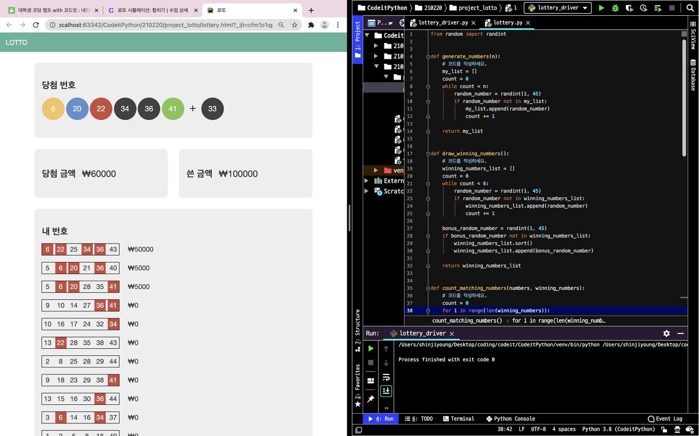

# 토픽4. 파이썬 응용하기

### random 모듈

- randint(a, b): a 이상 b 이하를 만족하는 랜덤한 정수 리턴
- uniform(a, b): a 이상 b 이하를 만족하는 랜덤한 소수 리턴

### datetime 모듈

```python
import datetime

# 날짜 타입으로 출력
pi_day = datetime.datetime(2020, 3, 14)
print(pi_day)# 2020-03-14 00:00:00# 오늘 날짜
today = datetime.datetime.now()
print(today)# 2020-04-05 17:49:12.360266# 두 날짜 사이의 기간 timedelta
today = datetime.datetime.now()
pi_day = datetime.datetime(2020, 3, 14, 13, 6, 15)
print(today - pi_day)# 22 days, 4:42:57.360266# datetime의 구조
today = datetime.datetime.now()

print(today)# 2020-04-05 17:59:21.709817
print(today.year)# 연도 2020
print(today.month)# 월 4
print(today.day)# 일 5
print(today.hour)# 시 17
print(today.minute)# 분 59
print(today.second)# 초 21
print(today.microsecond)# 마이크로초 709817# datetime 포맷팅

today = datetime.datetime.now()

print(today)# 2020-04-05 18:09:55.233501
print(today.strftime("%A, %B %dth %Y"))# Sunday, April 05th 2020
```

### 📁 Project: 로또 시뮬레이션


